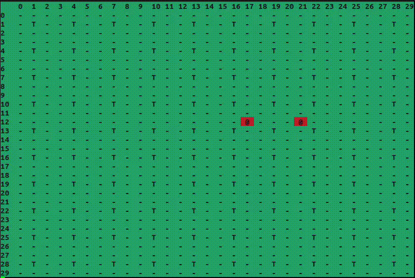

## Simulador de um Sistema Detector de Incêndios Florestais


### Integrantes do grupo

- [@Brun02](https://github.com/Brun02)
- [@OliveiraUP](https://github.com/OliveiraUP)
- [@marcos-c1](https://github.com/marcos-c1)


Para rodar esse projeto, utilize o comando make run e execute o arquivo *main* gerado.

```bash
$  make run
```

Este comando irá gerar os arquivos de objeto compilado que estarão contidos na pasta **obj**. Por fim, execute o arquivo *main.o* dentro desta pasta.

```bash
$   ./obj/main.o
```
Para remover os arquivos de objeto compilado, use o comando make rm.

```bash
$   make rm
```

### Como o sistema funciona?

O sistema de detector de incêndios florestal monitora e combate os incêndios no mapa florestal de dimensão **30x30**. 
A floresta é composta por nós sensores que identificam os focos de incêndio em sua vizinhança e espalham as mensagens para os nós sensores vizinhos até que a central receba a mensagem e envie um bombeiro para apagar o foco de incêndio. 

Os nós sensores estão agrupados em regiões específicas do mapa, geralmente em blocos 3x3, verificando a cada <b style="color: aquamarine;">1seg</b> se houve alguma ocorrência de incêndio em sua vizinhança. A cada <b style="color: aquamarine;">5seg</b> há um foco de incêndio na floresta e ao detectar um foco em suas vizinhanças, este nó sensor deve comunicar todos os nós sensores vizinhos para que estes espalhem a informação até o nó central que irá comunicar o bombeiro para apagar o fogo.

Cada nó é estruturado em uma **thread**, assim como a <b style="color: green;"> central</b> e o <b style="color: red;">bombeiro</b>. Todo foco de incêndio é representado como <span style="color: black; font-style: bold; background-color: red; padding: 3px; text-items: center;">@</span> registrado no arquivo *incendios.log* pela thread central a partir das informações recebidas pelos nós sensores. A thread <b style="color: red;">bombeiro</b> apaga os focos de incêndio a cada <b style="color: aquamarine;">2seg</b>.

### Implementação do código

O código foi dividido em 3 bibliotecas dinâmicas: **sensores.c, utils.c e main.c**. O arquivo *sensores.c* é responsável pela implementação das threads e da comunicação entre cada uma delas, o arquivo terá todo o escopo referente as estruturas das threads e das rotinas. O arquivo *utils.c* é usado como ferramenta para a construção e implementação dos outros códigos, ou seja, é um arquivo que conterá funções úteis e códigos repetitivos. Por fim, o arquivo principal que irá referenciar as rotinas do arquivo *sensores.c* e irá imprimir as interações com o mapa florestal.
